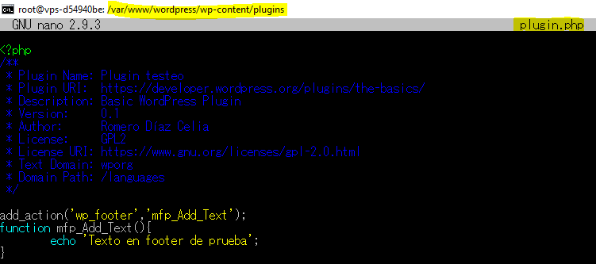
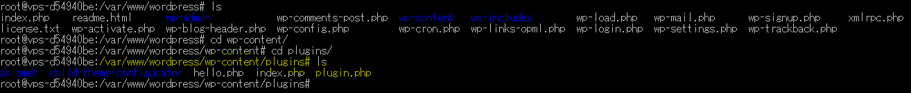
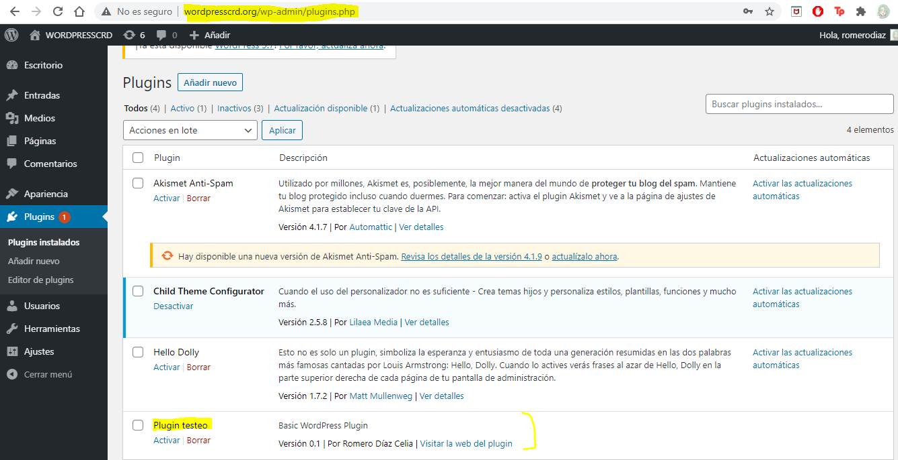
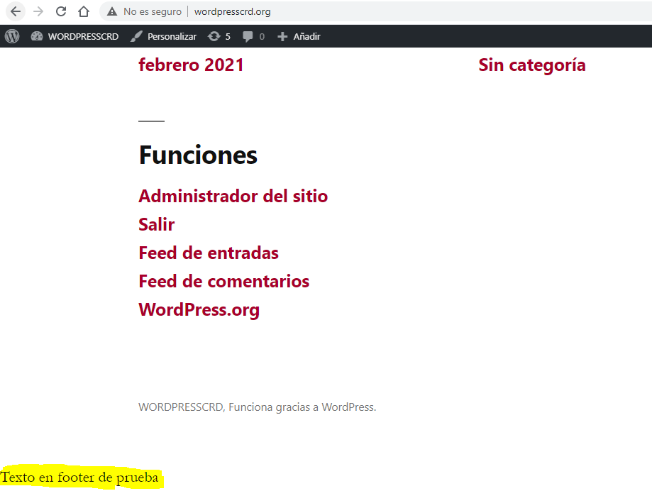
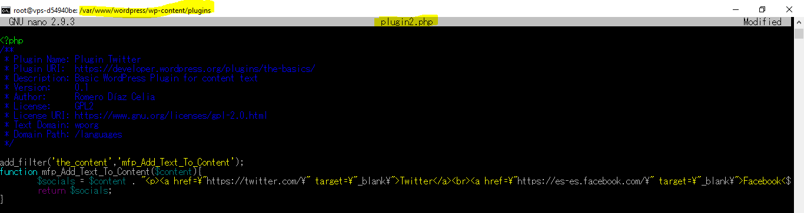
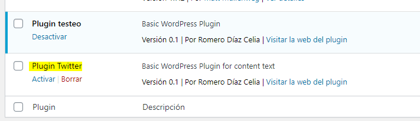
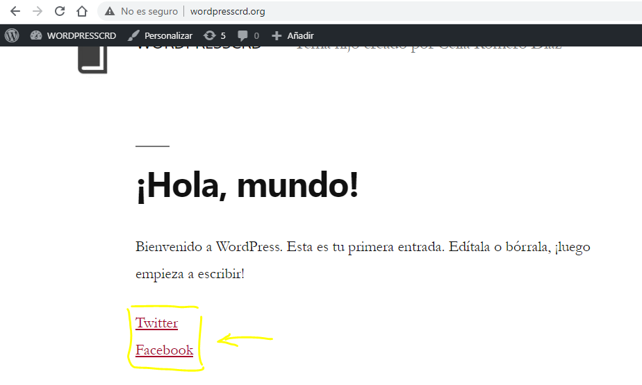

1.- Crea un Plugin para mostrar texto después del pie de cada página [Utiliza el gancho de acción wp_footer(), que se llama justo antes de la etiqueta </body> de cierre de cada página, y añade una nueva función llamada mfp_Add_Text(). Cargarlo en la carpeta correspondiente y actívalo en el Panel de control del administrador para ver el cambio.]

Para realizar esto tendremos que empezar por añadir el plugin dentro del directorio /wp-content/plugins, creando dentro de este un archivo que será php en el cual tendremos los comentarios necesarios para la creación de nuestro plugin. También, en nuestro caso, tendremos que agregar la función que deseemos se ejecute en el hook wp_footer, lo cual lo vamos a agregar utilizando la función add_action.

Habiendo realizado esto y tras guardarlo correctamente, podemos dirigirnos a nuestro menú propio de plugins que tenemos en nuestro Wordpress para comprobar que, efectivamente, se puede activar nuestro plugin creado por nosotros mismos.

Para comprobar que es funcional podemos utilizar como ejemplo nuestro tema hijo creado en Wordpress, mostrando que, efectivamente, al final de la página se muestra el texto de prueba que habíamos colocado en nuestro plugin.

2. Crea otro Plugin en el cual añades un hook de filtro para que a todo contenido de un post le aparezca al final dos enlaces a redes sociales, como por ejemplo FaceBook y Twitter.

Como en el caso anterior, creamos nuestro plugin en el mismo directorio, esta vez realizando otras funciones distintas para que se nos muestren los enlaces que queremos. En nuestro querremos que se enlace a Twitter y Facebook.

Como antes, si vamos a nuestra página de plugins en Wordpress también veremos que nuestro nuevo plugin está disponible y que se puede activar, lo cual haremos en este instante.

Si no ha habido ningún problema, una vez activado nuestro plugin, se nos mostrará unos links en nuestro wordpress los cuales nos llevarán a otra pestaña del navegador en la cual se abrirá Twitter o Facebook, según elijamos.

